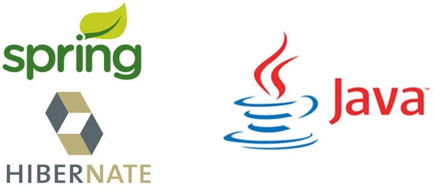

  

# Ejercicios de la asignatura Acceso a datos
Este repositorio contiene los proyectos de la asignatura **Acceso a Datos** del segundo año del ciclo [Desarrollo de Desarrollo de Aplicaciones Multiplataforma](https://www.juntadeandalucia.es/educacion/portals/web/formacion-profesional-andaluza/fp-grado-superior/detalle-titulo?idTitulo=51).

En esta asignatura se desarrollan aplicaciones para gestionar información almacenada en ficheros (**XML**) y bases de datos relacionales. Se han utilizado herramientas de mapeo objeto relacional (ORM) como **Hibernate** y **Spring Boot**.
